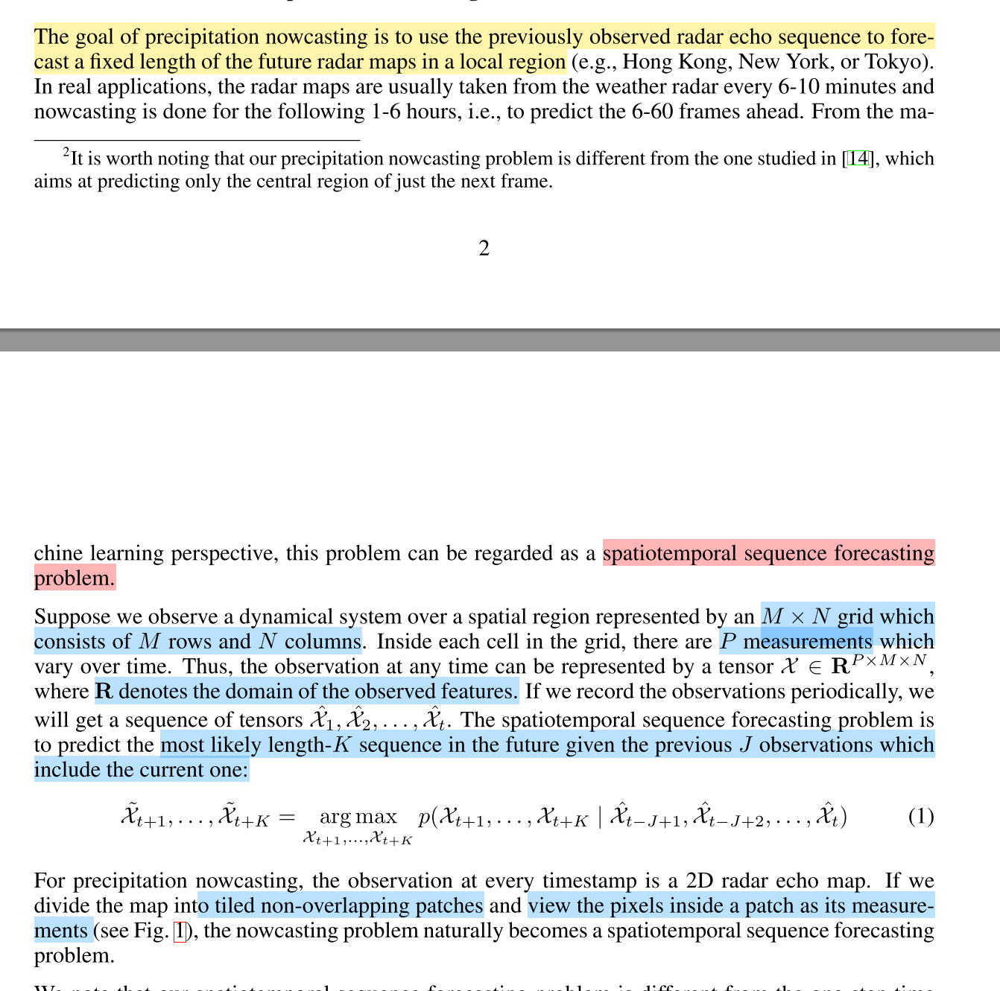
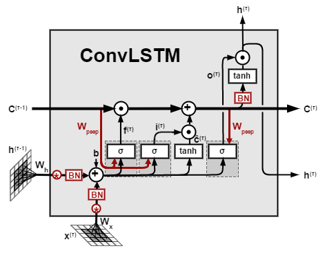
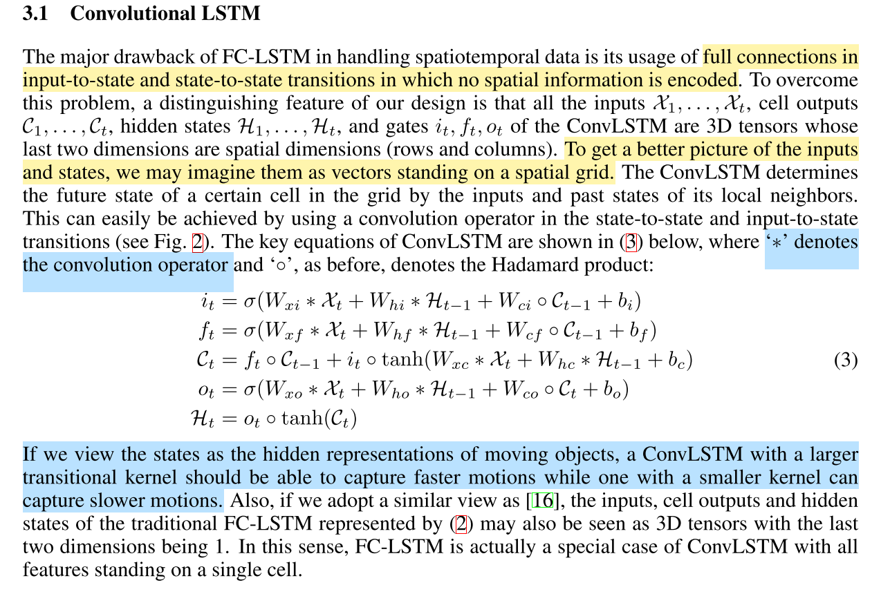
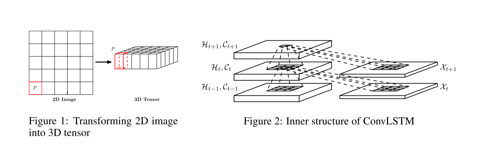
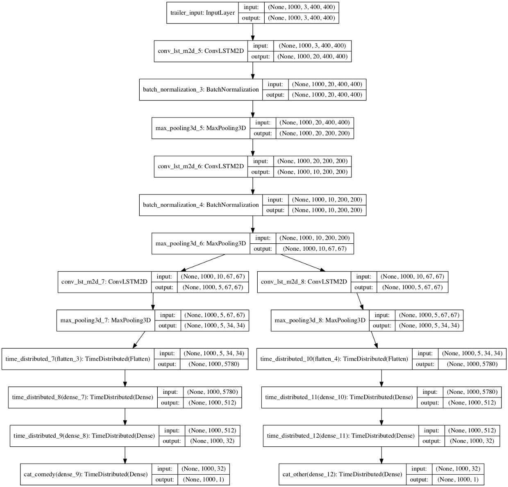

## ConvbLSTM 

**Reference Paper:** [Convolutional LSTM Network: A Machine Learning Approach for Precipitation Nowcasting](https://papers.nips.cc/paper/5955-convolutional-lstm-network-a-machine-learning-approach-for-precipitation-nowcasting.pdf)

**Reference Blog:** [An introduction to ConvLSTM](https://medium.com/neuronio/an-introduction-to-convlstm-55c9025563a7)

### 时空序列预测问题

### ConvLSTM Cell 
结构上和FC_LSTM结构相同，相比其他LSTM多了内窥结构，但是ConvLSTM不同之处是全连接计算方式变为卷积计算形式，如面公式（3）

### ConvLSTM 代码结构（基于keras）
