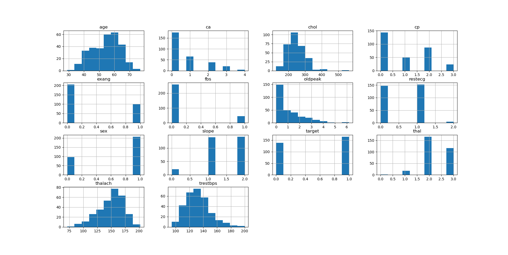
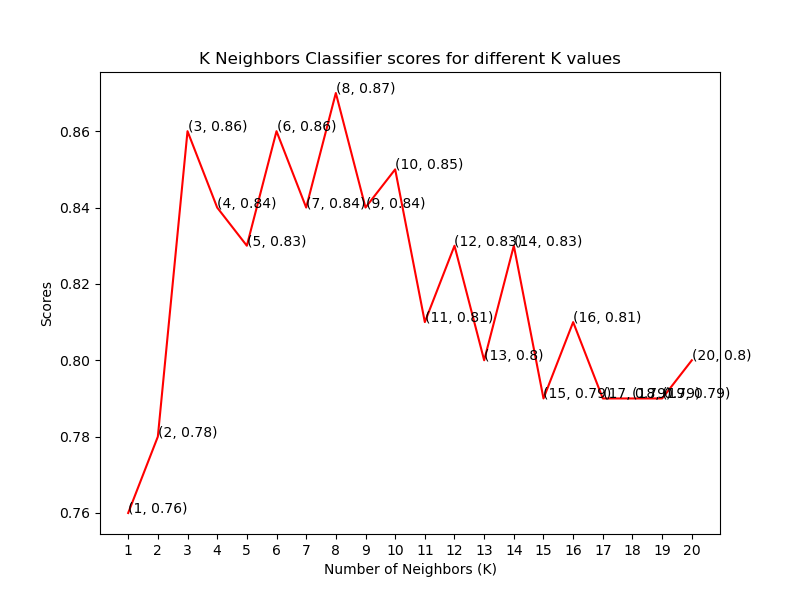

# Heart Disease Predict by EHR dataset

EHR数据来源Kaggle [https://www.kaggle.com/ronitf/heart-disease-uci](https://www.kaggle.com/ronitf/heart-disease-uci)

**********************************
## 数据基本统计信息

    dataset.info()

查看dataset内容信息

    <class 'pandas.core.frame.DataFrame'>
    RangeIndex: 303 entries, 0 to 302
    Data columns (total 14 columns):
     #   Column    Non-Null Count  Dtype  
    ---  ------    --------------  -----  
     0   age       303 non-null    int64  
     1   sex       303 non-null    int64  
     2   cp        303 non-null    int64  
     3   trestbps  303 non-null    int64  
     4   chol      303 non-null    int64  
     5   fbs       303 non-null    int64  
     6   restecg   303 non-null    int64  
     7   thalach   303 non-null    int64  
     8   exang     303 non-null    int64  
     9   oldpeak   303 non-null    float64
     10  slope     303 non-null    int64  
     11  ca        303 non-null    int64  
     12  thal      303 non-null    int64  
     13  target    303 non-null    int64  
    dtypes: float64(1), int64(13)
    memory usage: 33.3 KB

查看dataset的基本统计信息

    dataset.describe(include="all").to_csv("./doc/data_describe.csv")
    
统计结果：

**********************************
## 可视化的展现数据的特征

- 1、各特征值之间的相关系数矩阵

        rcParams['figure.figsize'] = 20, 14
        plt.matshow(dataset.corr())
        plt.yticks(np.arange(dataset.shape[1]), dataset.columns)
        plt.xticks(np.arange(dataset.shape[1]), dataset.columns)
        plt.colorbar()
        pylab.show()

&emsp;&emsp;相关系数矩阵：

- 2、各特征值频率直方图

        dataset.hist()
        plt.show()
        
&emsp;&emsp;频率直方图：

- 3、目标类别分类，以及各类的频率分布

        rcParams['figure.figsize'] = 7,6
        plt.bar(dataset['target'].unique(), dataset['target'].value_counts(), color = ['red', 'green'])
        plt.xticks([0, 1])
        plt.xlabel('Target Classes')
        plt.ylabel('Count')
        plt.title('Count of each Target Class')
        plt.show()
        
&emsp;&emsp;类别分类频率图:

**********************************
## 数据处理
&emsp;&emsp;使用
        
        dataset = pd.get_dummies(dataset, columns=['sex', 'cp', 'fbs', 'restecg', 'exang', 'slope', 'ca', 'thal'])

&emsp;&emsp;对各属性值进行一次编码，少量分类信息分解成0-1分类问题
&emsp;&emsp;结果：
        
        <class 'pandas.core.frame.DataFrame'>
        RangeIndex: 303 entries, 0 to 302
        Data columns (total 31 columns):
         #   Column     Non-Null Count  Dtype  
        ---  ------     --------------  -----  
         0   age        303 non-null    int64  
         1   trestbps   303 non-null    int64  
         2   chol       303 non-null    int64  
         3   thalach    303 non-null    int64  
         4   oldpeak    303 non-null    float64
         5   target     303 non-null    int64  
         6   sex_0      303 non-null    uint8  
         7   sex_1      303 non-null    uint8  
         8   cp_0       303 non-null    uint8  
         9   cp_1       303 non-null    uint8  
         10  cp_2       303 non-null    uint8  
         11  cp_3       303 non-null    uint8  
         12  fbs_0      303 non-null    uint8  
         13  fbs_1      303 non-null    uint8  
         14  restecg_0  303 non-null    uint8  
         15  restecg_1  303 non-null    uint8  
         16  restecg_2  303 non-null    uint8  
         17  exang_0    303 non-null    uint8  
         18  exang_1    303 non-null    uint8  
         19  slope_0    303 non-null    uint8  
         20  slope_1    303 non-null    uint8  
         21  slope_2    303 non-null    uint8  
         22  ca_0       303 non-null    uint8  
         23  ca_1       303 non-null    uint8  
         24  ca_2       303 non-null    uint8  
         25  ca_3       303 non-null    uint8  
         26  ca_4       303 non-null    uint8  
         27  thal_0     303 non-null    uint8  
         28  thal_1     303 non-null    uint8  
         29  thal_2     303 non-null    uint8  
         30  thal_3     303 non-null    uint8  
        dtypes: float64(1), int64(5), uint8(25)
        memory usage: 21.7 KB
        
&emsp;&emsp;使用StandardScale()对数据非0-1属性列进行归一化处理
        
        standardScaler = StandardScaler()
        columns_to_scale = ['age', 'trestbps', 'chol', 'thalach', 'oldpeak']
        dataset[columns_to_scale] = standardScaler.fit_transform(dataset[columns_to_scale])

**********************************
## 机器学习过程
### 数据集划分
&emsp;&emsp;对数据划分成训练集和测试集，使用sklearn包的train_test_split()方法，测试集占总数1/3

        y = dataset['target']
        X = dataset.drop(['target'], axis=1)
        X_train, X_test, y_train, y_test = train_test_split(X, y, test_size=0.33, random_state=0)

&emsp;&emsp;查看一下X_train的信息：

        <class 'pandas.core.frame.DataFrame'>
        Int64Index: 203 entries, 252 to 172
        Data columns (total 30 columns):
         #   Column     Non-Null Count  Dtype  
        ---  ------     --------------  -----  
         0   age        203 non-null    float64
         1   trestbps   203 non-null    float64
         2   chol       203 non-null    float64
         3   thalach    203 non-null    float64
         4   oldpeak    203 non-null    float64
         5   sex_0      203 non-null    uint8  
         6   sex_1      203 non-null    uint8  
         7   cp_0       203 non-null    uint8  
         8   cp_1       203 non-null    uint8  
         9   cp_2       203 non-null    uint8  
         10  cp_3       203 non-null    uint8  
         11  fbs_0      203 non-null    uint8  
         12  fbs_1      203 non-null    uint8  
         13  restecg_0  203 non-null    uint8  
         14  restecg_1  203 non-null    uint8  
         15  restecg_2  203 non-null    uint8  
         16  exang_0    203 non-null    uint8  
         17  exang_1    203 non-null    uint8  
         18  slope_0    203 non-null    uint8  
         19  slope_1    203 non-null    uint8  
         20  slope_2    203 non-null    uint8  
         21  ca_0       203 non-null    uint8  
         22  ca_1       203 non-null    uint8  
         23  ca_2       203 non-null    uint8  
         24  ca_3       203 non-null    uint8  
         25  ca_4       203 non-null    uint8  
         26  thal_0     203 non-null    uint8  
         27  thal_1     203 non-null    uint8  
         28  thal_2     203 non-null    uint8  
         29  thal_3     203 non-null    uint8  
        dtypes: float64(5), uint8(25)
        memory usage: 14.5 KB

### K-Neighbors Classifier
&emsp;&emsp;使用sklearn包的KNeighborsClassifier方法，利用循环K值分成1-21类看各类的得分

        knn_scores = []
        for k in range(1, 21):
            knn_classifier = KNeighborsClassifier(n_neighbors=k)
            knn_classifier.fit(X_train, y_train)
            knn_scores.append(knn_classifier.score(X_test, y_test))
            
&emsp;&emsp;各K值的得分：

&emsp;&emsp;k值为8时得到最高分87%

### Support Vector Classifier

&emsp;&emsp;使用sklearn包的SVC方法,利用不同的kernel进行分析

        svc_scores = []
        kernels = ['linear', 'poly', 'rbf', 'sigmoid']
        for i in range(len(kernels)):
            svc_classifier = SVC(kernel = kernels[i])
            svc_classifier.fit(X_train, y_train)
            svc_scores.append(svc_classifier.score(X_test, y_test))

&emsp;&emsp;各kernel的得分情况：

&emsp;&emsp;从结果上看，使用linear kernel表现最好，得分最高

### Decision Tree Classifier
&emsp;&emsp;使用sklearn包的DecisionTreeClassifier方法

        dt_scores = []
        for i in range(1, len(X.columns) + 1):
            dt_classifier = DecisionTreeClassifier(max_features=i, random_state=0)
            dt_classifier.fit(X_train, y_train)
            dt_scores.append(dt_classifier.score(X_test, y_test))

&emsp;&emsp;决策树的得分情况：

&emsp;&emsp;从结果上看，使用max_features选[2,4,18]时表现最好，得分最高